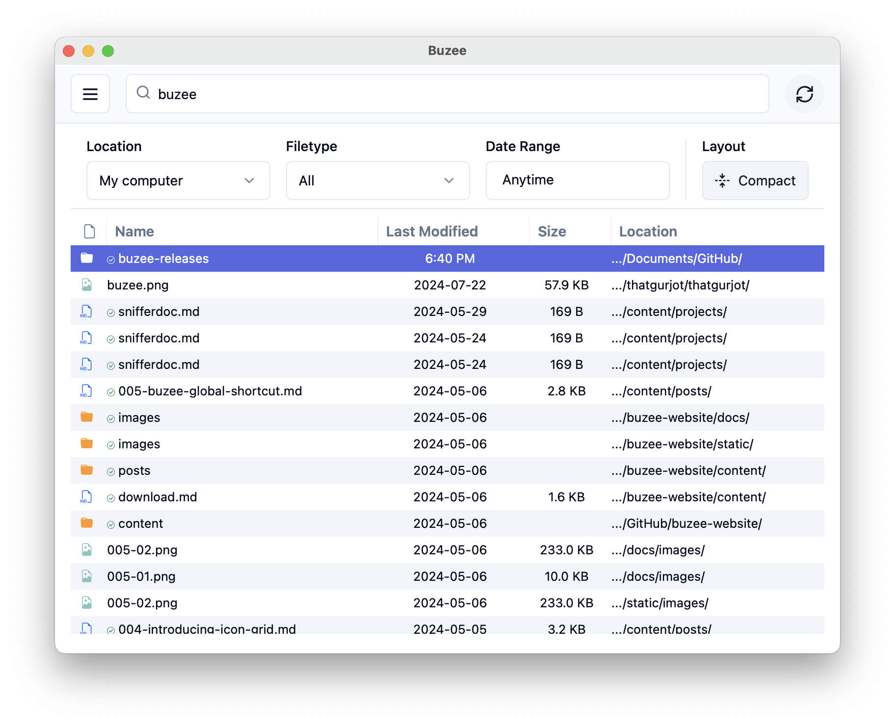
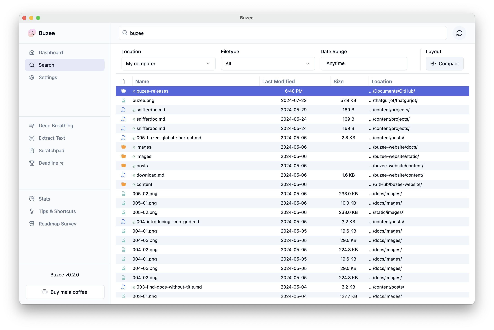
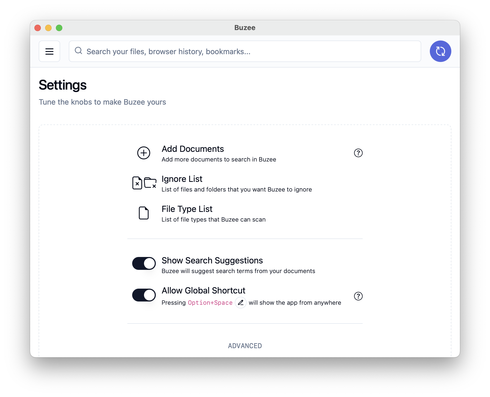
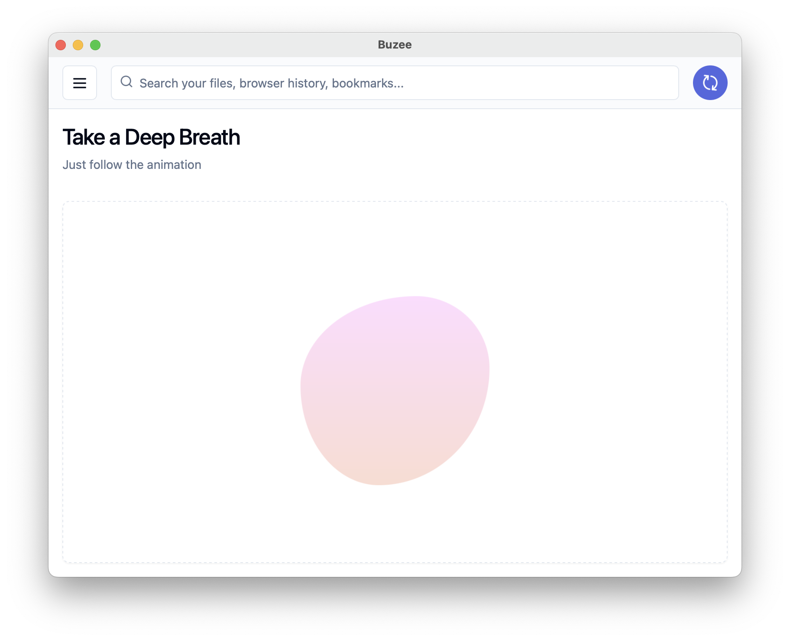

<div align="center">


<p align="center"><span>Full-text search app for Mac and Windows</span></p>

Download the latest release from the [Buzee website](https://buzee.co/).
</div>

> ⚠️ I have _just_ open sourced Buzee. The documentation is lacking. Please open an issue and I'd be happy to help! ⚠️

> The OCR capabilities in Buzee are built on top of [Textra on Mac](https://github.com/freedmand/textra) and [WinOCR on Windows](https://github.com/gsidhu/winocr_cli). Do check these repos out! I feel the native OCR capabilities of Mac and Windows are really good and should be used more!

## What is Buzee?

Buzee (pronounced _boozey_) is a eight-year-old labrador retriever who can't play fetch but can love you like no other.

Buzee is also a full-text search application for your life. It helps you find your files, effortlessly.

Download v0.2.0 from this [Releases](https://github.com/gsidhu/buzee-releases/releases) page.

## Screenshots

<div style="display:flex">
  
  
  
  
</div>


## Features
- Fast, full-text search for all your documents, images, audio, video, folders, and browser history.
- Search all local documents and folders by keyword, time, type, or any combination of these.
- Ignore specific files or folders from being indexed. Or ignore only their content.
- Global shortcut. Press `⎇ / Alt + Space` anywhere to show/hide the app. Modify it in the settings.
- In the app, press `⌘ / Ctrl + F or K` to go to the search bar from any screen.
- In the app, press `⌘ / Ctrl + Shift + S` to go to the scratchpad from any screen.
- View statistics about your files and get your Unique Document Profile.
- Sub-features:
  - Extract text from PDFs and Images using OCR.
  - Use a Scratch Pad to quickly jot down notes.
- Automatically syncs with changes on your filesystem.
- Lightweight installation package and low memory usage.
- Supports these default file types:
```
Documents: csv, docx, key, md, numbers, pages, pdf, pptx, txt, xlsx, xls
Images: jpg, jpeg, png, gif
Books: epub, mobi, azw3, pdf
Audio: mp3, wav, aac, flac, ogg
Video: mp4, mkv, avi, mov, wmv
```

### Semantic Search (somewhat)
#### Include/Exclude from Search
- Use the Filetype filter or simply type it in the search (like `invoice pdf`)
- Put quotes around keyword(s) to search for the exact phrase (like `"annual report"`)
- Put a hyphen in front of the keyword to exclude it from search (like `"annual report" -2022 -pdf`)

#### Search using Time
Use the Date Range filter or simply mention the date/time period that you are looking for in your search. For example:

- <code><strong>last month</strong> pdf invoice</code>
- <code>annual report ppt <strong>this year</strong></code>
- <code><strong>q2 2023 to q3 2023</strong> retail report xlsx</code>
- <code>prelim findings <strong>from 2017 to 2022</strong></code>
- <code>cv docx <strong>from march 2 2020 to aug 15 2020</strong> -pdf</code>
- <code>scope study <strong>14/02/2015 to 10/08/2015</strong></code>

If you want to use a phrase as a keyword for search and not time, simply wrap it in quotes like this: `invoice "March 2022"`

## Building from Source
Buzee works best on Mac. Windows may throw up some issues because I haven't had a change to properly test it. Linux is untested entirely, so you're on your own there.

1. Clone the repository.
2. Install Rust and NodeJS.
3. Run `npm install` in the root directory.
4. Run `cargo install` in the `src-tauri` directory.
5. Run `npm run tauri dev` in the root directory to run the app in development mode.
6. Run `npm run tauri build` in the root directory to build the app for production.

### Building on Windows
Building on Windows requires a few changes. Follow these steps:

1. Remove `drag = { path = "./crates/drag", version = "0.4.0", features = [ "serde" ] }` from [`Cargo.toml`](https://github.com/gsidhu/buzee-tauri/blob/main/src-tauri/Cargo.toml#L28C1-L28C77)
2. Comment out `crate::drag::start_drag,` from [`ipc.rs`](https://github.com/gsidhu/buzee-tauri/blob/main/src-tauri/src/ipc.rs#L506C7-L506C31)
3. Comment out `mod drag;` from [`main.rs`](https://github.com/gsidhu/buzee-tauri/blob/main/src-tauri/src/main.rs#L30)

Finally, replace `binaries/textra` with `binaries/winocr` in [`tauri.conf.json`](https://github.com/gsidhu/buzee-tauri/blob/main/src-tauri/tauri.conf.json#L38).

---

## TODO / Known Issues
```
Index:
(~) : partly implemented
(+) : has to be built from scratch
(?) : not sure if it will add great value
```

- (~) Show matching text for search results by reading from the `body` table.
- (~) Browser history search should support complex queries the way document search does.
- (~) Icon view should load thumbnails in an efficient, non-blocking manner. Thumbnails should show up on the page as they are loaded.
- (~) Enable adding 'comments' to documents.
- (~) Enable pinning documents/folders to the top of search results.
- (~) Allow user to add or remove supported file types.
- (~) Allow user to switch between profiles on Arc and Chrome. (Currently uses the default profile)
- (~) Test for Linux.
- (~) Improve the speed of parsing PDFs, Images and XLSX files. Especially OCR operations.
- (+) Enable adding 'tags' to documents.
- (+) Create a 'Dashboard' view that shows statistics, pinned documents, and recent searches.
- (+) Add tests to the codebase.
- (?) Record frecency of documents and use it to sort search results.

## Tech Stack
### Dependencies
Back-end:
- Rust 
- Tauri v2
- SQLite
- Tantivy

Front-end:
- Svelte 4 using TypeScript
- shadcn-svelte
- TailwindCSS

See all dependencies in the [Cargo.toml](/src-tauri/Cargo.toml) and [package.json](/package.json) files.

### Architecture
- All file metadata is stored in SQLite in the `document` table. A central `metadata` table stores the metadata from files and eventually cloud services, emails etc. 
- A full-text index is created on `metadata` and stored as the `metadata_fts` table.
- Parsed text from documents is stored in the `body` table.
- A full-text index is created in Tantivy at the same time.
- The Firefox, Chrome and Arc history is searched using their respective history databases directly.
- All front-end code is in the `src` directory. All back-end code is in the `src-tauri` directory.

## Contributing / Way Forward
Read the [Vision and Roadmap](./VISION&ROADMAP).

I have spent two years building this project. It started as an Electron app, then I switched to Tauri for performance gains. When I started I barely new JavaScript and Svelte. Over the course of development, I learned NodeJS, TypeScript, SQLite, Rust, Tauri, Tantivy, and many other technologies. I learned so much about managing a project of this size and complexity. I am proud of what I have built but I am more proud of what I have learned.

I am now letting go of this project because I have other priorities. Please feel free to do with this project as you wish. I am happy to help you get started with the codebase.

If nothing else, this project can serve as an example of how to build a full-text search engine using Tauri and Tantivy. There are several tiny features and performance workarounds that I have implemented that you might find useful.

If you do do something with this project, please let me know. I would love to see what you build!

## License
MIT